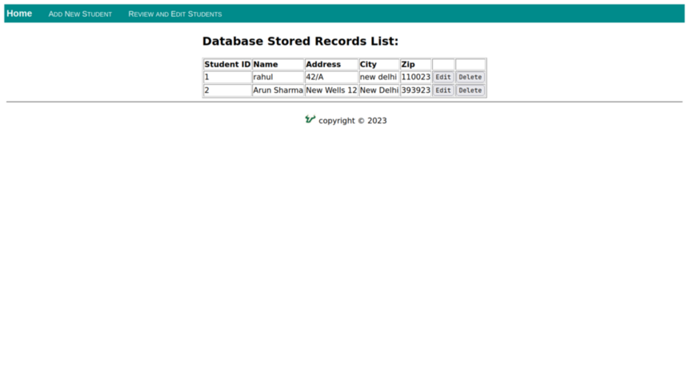

# StudentDB
Simple Flask CRUD app with sqlite as database


### Installation
```bash
pip install -r requirements.txt
flask run
```

## Images





## License
This project is licensed under [GPL-3.0](https://raw.githubusercontent.com/Illumina/licenses/master/gpl-3.0.txt)
